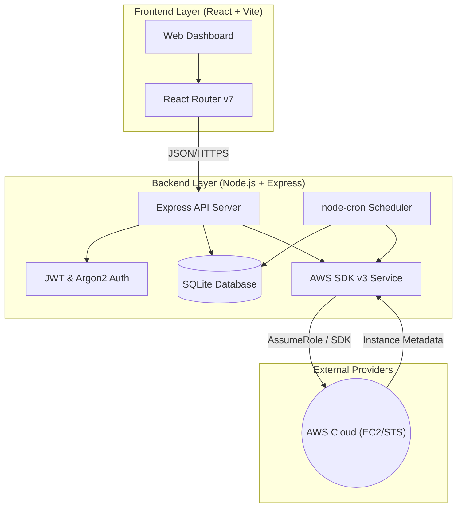

# 🌙 CloudNap (Hibernate 2.0)

[](file:///home/bhushan/eLitmus/hibernate-2.0/package.json)
[](https://aws.amazon.com/)

**CloudNap** is a professional-grade AWS EC2 instance management and cost-optimization platform. It enables users to securely manage their cloud infrastructure, monitor instance states, and automate start/stop schedules to eliminate waste and reduce cloud spend.

---

## 🚀 Key Features

-   **🔒 Secure Multi-Tenancy**: Full user authentication system with secure password hashing (Argon2) and JWT-based session management.
-   **🛡️ Dynamic IAM Integration**: Securely connect to your AWS infrastructure using temporary credentials via STS (AssumeRole), ensuring zero long-lived key exposure.
-   **📅 Automated Scheduling**: Intelligent background scheduler to automatically start and stop EC2 instances based on custom time and day-of-week patterns.
-   **⚡ Real-time Control**: Interactive dashboard for instantaneous toggling of instance states across multiple regions.
-   **🛠️ CLI Utility**: Powerful command-line interface for rapid instance management directly from your terminal.
-   **🐳 Dockerized Deployment**: Fully containerized architecture for seamless scaling and simplified deployment via Nginx reverse proxy.

---

## 🏗️ System Architecture

CloudNap follows a modern, decoupled architecture designed for security, scalability, and ease of use.



---

## 💻 Tech Stack

| Category | Technology |
| :--- | :--- |
| **Frontend** | React 18, Vite, Framer Motion, Lucide React, Tailwind CSS |
| **Backend** | Node.js, Express 5, JWT, Argon2 |
| **Database** | SQLite (Better-SQLite3) |
| **Cloud** | AWS SDK v3 (EC2, STS) |
| **Automation** | node-cron |
| **DevOps** | Docker, Docker Compose, Nginx |

---

## 🚦 Getting Started

### Prerequisites

-   **Node.js** (v18+ recommended)
-   **npm** or **yarn**
-   **Docker & Docker Compose** (for containerized setup)
-   **AWS Account** with an IAM Role configured for Hibernate access.

### 🏠 Local Setup

1.  **Clone the repository:**
    ```bash
    git clone https://github.com/Bhushan21z/CloudNap.git
    cd hibernate-2.0
    ```

2.  **Environment Configuration:**
    Create a `.env` file in the root and backend directories:
    ```env
    JWT_SECRET=your_super_secret_key
    PORT=5000
    # Optional: AWS_DEFAULT_REGION=ap-south-1
    ```

3.  **Install dependencies and Start:**
    ```bash
    # From root
    npm install
    npm run dev
    ```

### 🐳 Docker Setup

The easiest way to run the full stack (Frontend, Backend, and Nginx) is via Docker Compose:

```bash
docker-compose up -d
```
Access the application at `http://localhost`.

---

## 🛠️ AWS Configuration

To allow CloudNap to manage your instances, you need to set up a trust relationship in your AWS account.

1.  **Run the Setup Script:**
    Download and run `hibernate-setup.sh` on your machine where AWS CLI is configured.
    ```bash
    ./hibernate-setup.sh
    ```
2.  **Copy the Generated ARN**: The script will output a Role ARN. Paste this into the CloudNap settings dashboard.

---

## 📜 License

This project is licensed under the [ISC License](file:///home/bhushan/eLitmus/hibernate-2.0/package.json).

Created with ❤️ by [Bhushan](https://github.com/Bhushan21z)
